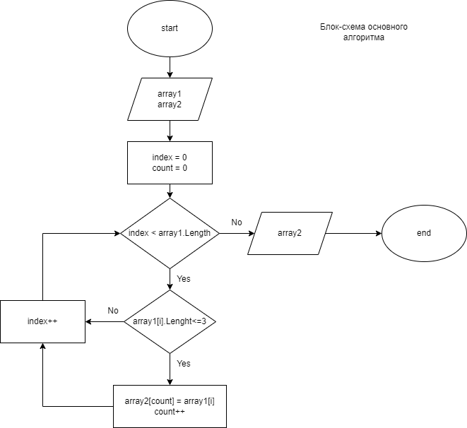

# Итоговая проверочная работа
## Для выполнения работы необходимо:
### 1. Создать репозиторий на GitHub. 

### 2. Нарисовать блок-схему алгоритма. 
Блок-схема находиться в папке FinalProject - Блок-схема.png и не добавлена в gitignore для удобства.

### 3. Снабдить репозиторий оформленным текстовым описанием решения. 
Этот файл Readme.md

### 4. Написать программу, решающую задачу.
**Задача.** Написать программу, которая из имеющегося массива строк формирует массив из строк, длина которых меньше либо равна 3 символа. Первоначальный массив можно ввести с клавиатуры, либо задать на старте выполнения алгоритма. При решении не рекомендуется пользоваться коллекциями, лучше обойтись исключительно массивами.

**Пример:**
["hello", "2", "world", ":-)"] => ["2", ":-)"]

### 5. Использовать контроль версий при работе над этим небольшим проектом (не должно быть так что все залито одним коммитом, как минимум этапы 2, 3 и 4 должны быть расположены в разных коммитах).

## Краткое описание решения:
Сначала создание методов для поиска размера второго массива, метода выбирающего подходящие элементы и метода печати подходящих элементов во второй массив. Потом введение первоначального массива и вызов вышеперечисленных методов.